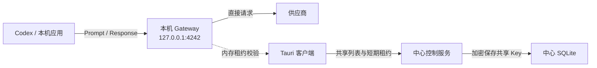

# AI Gateway

AI Gateway 已拆分为 **Tauri 本地客户端 + 无界面中心控制服务**。

## 最终架构

### `client`：本地数据面

`client` 包含全部桌面界面和本地数据面：

- `client/src-tauri`：Tauri 桌面壳、启动本机 Gateway、中心账号登录桥接和共享授权同步。
- `client/local-core`：供应商、API Key、OpenAI/ChatGPT 账号、模型、路由、推理转发、流式响应、用量、日志、诊断和 Codex 脚本。
- `client/web`：桌面客户端的全部 Web UI，包括本地功能及群组共享页面；由 Tauri 打包，不由中心服务托管。

本机 Gateway 固定监听：

```text
http://127.0.0.1:4242
```

Codex 和其他本机应用使用：

```text
http://127.0.0.1:4242/openai/v1
```

本地供应商、路由、模型、用量和诊断功能均不需要登录。

### `server`：中心控制面

`server` 是无界面服务，只负责：

- 中心用户账号、登录、Session 和个人访问 Token；
- 群组和群组成员；
- 可共享供应商连接；
- 群组与共享供应商的授权关系；
- 客户端设备记录和 5 分钟共享凭据租约。

中心服务不包含 Web 静态资源，也不提供供应商推理、模型、路由、用量或诊断接口。

中心服务默认监听：

```text
0.0.0.0:4242
```

本机客户端和中心服务可以使用相同端口，因为它们运行在不同机器上；本机 Gateway 只绑定 `127.0.0.1`。

## 请求与共享流程



共享流程：

1. 用户在 Tauri 客户端的“群组”页面登录中心账号。
2. 用户创建群组、管理成员，并选择一个本机 API Key 供应商进行共享。
3. Tauri 从本机加密数据库读取凭据，创建或更新中心共享连接，再把连接授权给群组；Web 页面不会获得明文 Key。
4. Tauri 客户端使用中心访问 Token 获取当前用户可见的共享连接。
5. 客户端为每个共享连接申请 5 分钟租约，并把凭据写入本机加密 SQLite。
6. 本机 Gateway 只在内存租约有效时允许选择和调用共享供应商。
7. 客户端每 60 秒同步一次。成员被移除或共享被取消后，中心不再发放租约，本机最迟在现有租约到期后停止使用。

中心服务不会接收 Prompt、工具结果、模型流量或供应商响应。所有推理流量始终是：

```text
本机应用 -> 127.0.0.1:4242 -> 供应商
```

当前安全边界只约束官方本机 Gateway。共享 Key 会加密存储，普通成员不会在 UI 中看到明文，但拥有本机完全控制权的用户仍可能通过逆向或内存分析提取凭据。

## 目录

```text
.
├── Cargo.toml
├── client
│   ├── local-core     # 本地 Gateway 数据面
│   ├── src-tauri      # Tauri 客户端
│   └── web            # 客户端 Web UI
├── server             # 无界面中心控制服务
└── deploy.sh          # 只部署中心服务二进制
```

## 启动客户端

依赖：

- Rust
- Bun
- Tauri 对应平台的系统依赖

运行：

```bash
cargo run -p ai-gateway-client
```

构建：

```bash
cargo build -p ai-gateway-client
```

Tauri 构建脚本会自动在 `client/web` 中执行 Web 构建。

启动后点击顶部“群组”即可配置中心服务地址并登录。除该页面及共享同步外，
本地供应商、路由、推理、用量和诊断功能不依赖中心登录。

本机数据目录：

```text
~/.ai-gateway-client/
├── config.json
├── credentials.json.enc
├── credentials.key
└── gateway/
    └── db.sqlite
```

也可以在启动客户端前通过环境变量配置中心同步：

```bash
export AI_GATEWAY_CONTROL_URL="https://control.example.com"
export AI_GATEWAY_CONTROL_TOKEN="agw_..."
cargo run -p ai-gateway-client
```

未配置中心服务时，本地功能仍可独立使用。

## 启动中心服务

最小启动：

```bash
cargo run -p ai-gateway
```

中心数据保存在：

```text
~/.ai-gateway/db.sqlite
```

中心账号、群组和共享接口始终要求登录。首次启动时应创建首个管理员：

```bash
export AI_GATEWAY_BOOTSTRAP_ADMIN_EMAIL="admin@example.com"
export AI_GATEWAY_BOOTSTRAP_ADMIN_PASSWORD="change-me"
export AI_GATEWAY_BOOTSTRAP_ADMIN_NAME="管理员"
cargo run -p ai-gateway
```

可选环境变量：

| 变量 | 作用 |
| --- | --- |
| `AI_GATEWAY_DATABASE_ENCRYPTION_KEY` | 指定中心 SQLite 凭据加密密钥 |
| `AI_GATEWAY_FEISHU_APP_ID` | 飞书登录 App ID |
| `AI_GATEWAY_FEISHU_APP_SECRET` | 飞书登录 App Secret |
| `AI_GATEWAY_BOOTSTRAP_ADMIN_EMAIL` | 首个管理员邮箱 |
| `AI_GATEWAY_BOOTSTRAP_ADMIN_PASSWORD` | 首个管理员密码 |
| `AI_GATEWAY_BOOTSTRAP_ADMIN_NAME` | 首个管理员显示名称 |

中心服务自身不托管任何页面。群组、成员和供应商共享界面位于 Tauri 客户端；
首次管理员和其他中心账号仍可通过启动配置或中心 HTTP API 创建。

## 中心 API

中心只暴露以下类别：

```text
GET    /healthz

GET    /auth/status
GET    /auth/feishu/authorize
GET    /auth/feishu/callback
POST   /auth/login
GET    /auth/me
POST   /auth/logout
GET    /auth/access-tokens
POST   /auth/access-tokens

GET    /users
POST   /users
DELETE /users/:user_id
GET    /users/search

GET    /shared-connections
POST   /shared-connections
PUT    /shared-connections/:provider_id
DELETE /shared-connections/:provider_id

GET    /groups
POST   /groups
GET    /groups/:group_id
POST   /groups/:group_id/members
DELETE /groups/:group_id/members/:user_id
POST   /groups/:group_id/providers
DELETE /groups/:group_id/providers/:provider_id

GET    /client/v1/me
GET    /client/v1/shared-providers
POST   /client/v1/shared-providers/:provider_id/lease
```

中心明确不提供：

```text
/providers
/models
/routing
/usage
/gateway/issues
/openai/v1/models
/openai/v1/responses
```

## 本机 Gateway API

主要本地接口：

```text
GET    /healthz

GET    /providers
POST   /providers
DELETE /providers/:provider_id
GET    /providers/:provider_id/quota

POST   /accounts/openai/import-token
POST   /accounts/openai/login/device
GET    /accounts/openai/login/device/:login_id
DELETE /accounts/openai/login/device/:login_id

GET    /instances
GET    /instances/:instance_id/config
PUT    /instances/:instance_id/config
DELETE /instances/:instance_id

GET    /settings/automatic-routing
PUT    /settings/automatic-routing
GET    /settings/codex-client-version
PUT    /settings/codex-client-version
DELETE /settings/codex-client-version

GET    /routing/turns
GET    /usage/summary
GET    /usage/daily
GET    /gateway/issues
DELETE /gateway/issues

GET    /openai/v1/models
POST   /openai/v1/responses
GET    /instances/:instance_id/openai/v1/models
POST   /instances/:instance_id/openai/v1/responses

GET    /codex/setup.sh
GET    /codex/restore.sh
GET    /codex/instances.sh
```

本机 Gateway 不暴露 `/auth` 或 `/groups`。

## 部署中心服务

`deploy.sh` 只构建并同步中心服务二进制，不构建或上传 Web UI：

```bash
./deploy.sh
```

可覆盖：

```bash
DEPLOY_HOST=gateway.example.com \
DEPLOY_USER=deploy \
./deploy.sh
```

部署后健康检查地址仍为远端 `127.0.0.1:4242/healthz`。

## 验证

```bash
cd client/web
bun run typecheck
bun run build

cd ../..
cargo fmt --all
cargo check --workspace
cargo test --workspace
cargo build -p ai-gateway-client
bash -n deploy.sh
git diff --check
```

架构测试会验证：

- 本机 Gateway 无需登录；
- 群组界面位于 Tauri Web 中，本机 Gateway 不提供群组路由；
- 推理请求携带本机凭据直接到达模拟供应商；
- 共享供应商必须具有有效租约；
- 桌面访问 Token 可以调用中心群组接口，但不能调用任何推理数据面；
- 中心没有首页、Web 静态资源或 `/openai/v1` 推理路由。
